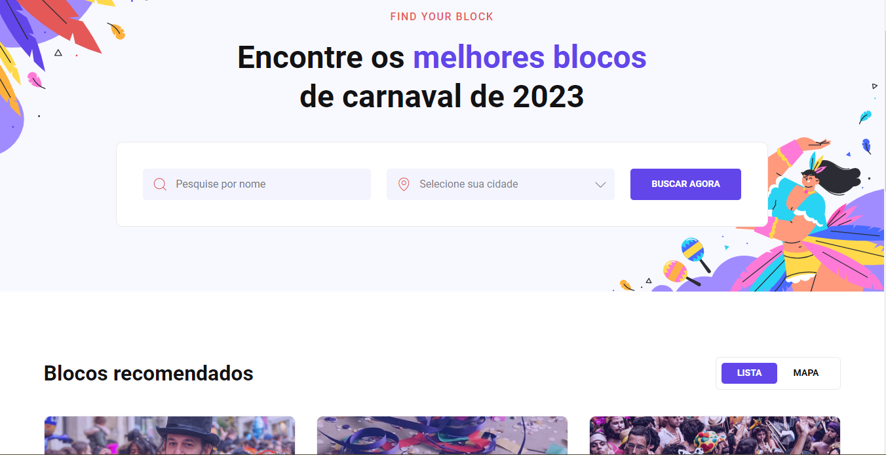

<h1 align="center"> Encontre seu bloco no carnaval! </h1>

A project developed during the #boraCodar 2023 with RocketSeat. Made to help people find the best carnival blocks close to them.  

  <a href="#-technologies">Technologies</a>&nbsp;&nbsp;&nbsp;|&nbsp;&nbsp;&nbsp;
  <a href="#-layout">Layout</a>

 

  

## 🚀 Technologies

This project was developed with the following technologies:

- HTML, CSS and JavaScript
- Git and Github
- Figma

## 🔖 Layout

You can check the project's layout through [THIS LINK](https://www.figma.com/community/file/1207675804423978995). It's necessary a [Figma](https://figma.com) account to access it.
